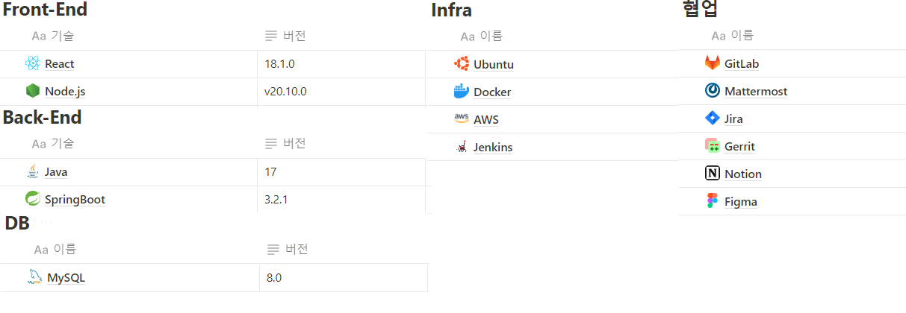
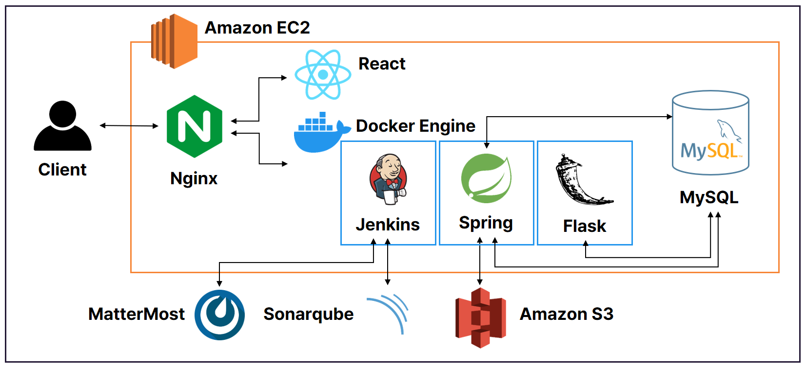
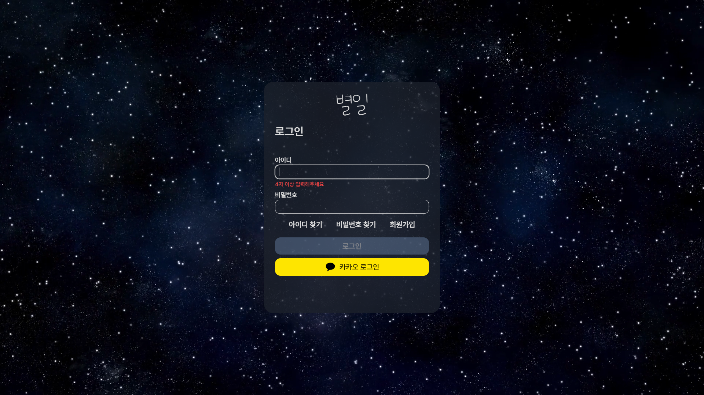
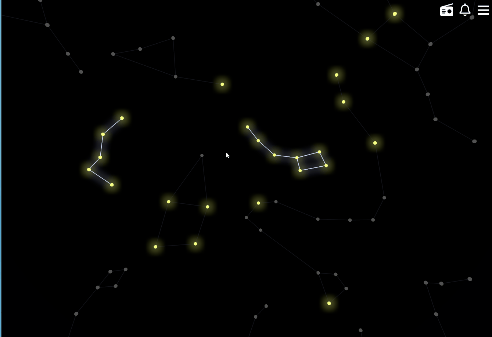

# 📖별일 - 평범했던 나의 하루에 찾아온 별일


### 🕰️ 개발 기간

**24.01.03일 - 24.02.17일 (7주)**
<br>
<br>

### ⭐️ 팀원 소개

|이혜진|이효재|전성수|김동학|조은영|조한빈|
|:---:|:---:|:---:|:---:|:---:|:---:|
|||||||

<br>

## 📌캠페인 개요
우리는 남기고 싶은 기억과 감정을 일기에 담습니다.<br><br>
대부분의 일기는 그렇게 기록되고 그렇게 기억에서 사라집니다.<br><br>
이런 일기를 특별한 계기나 우연으로 읽게 된다면 굉장히 반가운 일입니다.<br><br>
어린 시절 썼던 일기를 우연히 읽어본 경험처럼 말이에요.<br><br>
**별일은 이런 특별한 사건을 주기적으로 만들어주는 일기장입니다.<br><br>**
<br>


## 🎯주요 기능

**1.Three.js를 이용한 3차원 페이지에 구현된 별에 작성하는 일기.**

**2.사용자가 설정한 주기에 따라 과거에 썼던 일기 리마인드 기능.**

**3.랜덤 사용자에게 보내는 TTS 일기**


## 🛒Usage

````
git clone https://lab.ssafy.com/s10-webmobile2-sub2/S10P12B209.git

````


### ⚙개발환경




## 🏢Service Architecture




   
## ⌨️Stacks⌨️
[![Git][Git.com]][Git-url]

[![amazonec2][amazonec2.com]][amazonec2-url]
[![NGINX][NGINX.com]][NGINX-url]
[![Docker][Docker.com]][Docker-url]
[![jenkins][jenkins.com]][jenkins-url]
[![sonarqube][sonarqube.com]][sonarqube-url]

[![React][React.com]][React-url]
[![Java][Java.com]][Java-url]
[![SpringBoot][SpringBoot.com]][SpringBoot-url]
[![flask][flask.com]][flask-url]

[![Mysql][Mysql.com]][Mysql-url]
[![amazons3][amazons3.com]][amazons3-url]


[React.com]: https://img.shields.io/badge/react-0099FF?style=for-the-badge&logo=react&logoColor=white
[React-url]: https://ko.legacy.reactjs.org/
[Java.com]: https://img.shields.io/badge/Java-007396?style=for-the-badge&logo=springboot&logoColor=white
[Java-url]: https://www.java.com/ko/
[Mysql.com]: https://img.shields.io/badge/mysql-4479A1?style=for-the-badge&logo=springboot&logoColor=white
[Mysql-url]: https://www.mysql.com/
[git.com]: https://img.shields.io/badge/git-F05032?style=for-the-badge&logo=springboot&logoColor=white
[git-url]: https://git-scm.com/
[SpringBoot.com]: https://img.shields.io/badge/springboot-6DB33F?style=for-the-badge&logo=springboot&logoColor=white
[SpringBoot-url]: https://spring.io/
[docker.com]: https://img.shields.io/badge/docker-2496ED?style=for-the-badge&logo=docker&logoColor=white
[docker-url]: https://www.docker.com/
[NGINX.com]: https://img.shields.io/badge/NGINX-009639?style=for-the-badge&logo=NGINX&logoColor=white
[NGINX-url]: https://www.NGINX.com/
[jenkins.com]: https://img.shields.io/badge/jenkins-D24939?style=for-the-badge&logo=jenkins&logoColor=white
[jenkins-url]: https://www.jenkins.io/
[flask.com]: https://img.shields.io/badge/flask-000000?style=for-the-badge&logo=flask&logoColor=white
[flask-url]:https://flask.palletsprojects.com/en/3.0.x/
[sonarqube.com]: https://img.shields.io/badge/sonarqube-4E9BCD?style=for-the-badge&logo=sonarqube&logoColor=white
[sonarqube-url]:https://www.sonarsource.com/
[amazonec2.com]: https://img.shields.io/badge/amazonec2-E79537?style=for-the-badge&logo=amazonec2&logoColor=white
[amazonec2-url]:https://aws.amazon.com/ko/pm/ec2/
[amazons3.com]: https://img.shields.io/badge/amazons3-569A31?style=for-the-badge&logo=amazons3&logoColor=white
[amazons3-url]:https://aws.amazon.com/ko/pm/serv-s3/


## 📌서비스 화면

### 로그인


### 메인화면


### 게시글 작성


### 별자리 형성

 게시글 작성을 통해 별자리 내 모든 별을 등록 시 별자리 형성

### 라디오 



